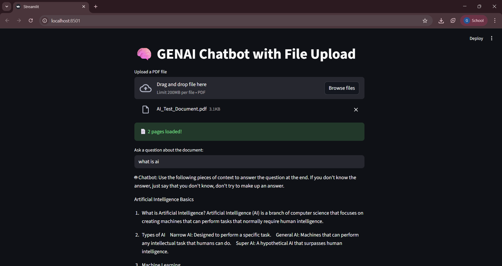

# 🧠 GENAI PDF Chatbot

A Streamlit-based RAG chatbot that allows users to upload a PDF and ask questions about it.

## 🚀 Features
- PDF Upload
- Text Chunking
- FAISS Vector Store
- HuggingFace Embeddings
- Local LLM (GPT-2 / FLAN-T5)

## 🛠 Tech Stack
- Streamlit
- LangChain
- HuggingFace
- FAISS

## 📸 Demo



## ▶ Run Locally

```bash
pip install -r requirements.txt
streamlit run my_chatbot.py
